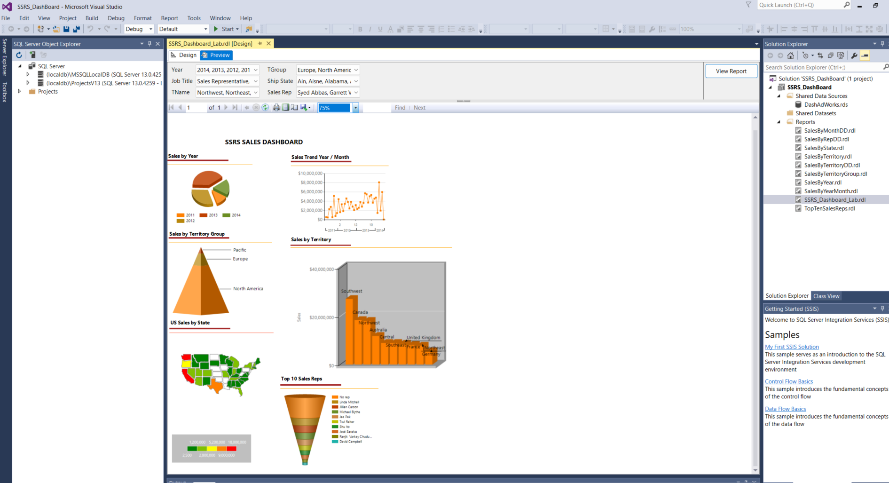

# SSRS Sales Dashboard Project

This project demonstrates the use of SQL Server Reporting Services (SSRS) to create interactive dashboards for monitoring and analyzing sales data.

## Project Overview

The **SSRS Sales Dashboard** provides insights into the following key metrics:
- **Sales by Year**: Visualizes sales data across different years (2011–2014) using a pie chart.
- **Sales Trend by Year/Month**: Displays sales trends over time, broken down by year and month, using a line chart.
- **Sales by Territory Group**: Uses a pyramid chart to show sales distribution across different regions (Pacific, Europe, North America).
- **Sales by Territory**: A bar chart that provides detailed sales data by individual territories such as Southwest, Canada, Northwest, and others.

## Dashboard Preview



## Key Components
- **Pie Chart**: Used to visualize sales by year (2011, 2012, 2013, and 2014).
- **Line Chart**: Tracks sales growth and fluctuations month-over-month.
- **Pyramid Chart**: Shows territory sales distribution across different regions.
- **Bar Chart**: Detailed sales numbers by specific territories.

## How to Use the Reports

1. **Dataset**: Connect the SSRS reports to the appropriate SQL Server database that stores the sales data.
2. **Modify Connection Strings**: Ensure that the reports' connection strings are properly set to point to the correct data source.
3. **Deploy Reports**: Deploy the reports to your SSRS server or run them locally using SQL Server Data Tools (SSDT).

## SQL Queries

The following SQL query is used to populate the dataset for the reports:

```sql
-- Example SQL query used for the Sales by Year report
SELECT YEAR(A.OrderDate) AS Year,
 MONTH(A.OrderDate) AS Month,
 ISNULL(E.FirstName + ' ' + E.LastName, 'No rep') AS SalesRep,
 ISNULL(E.JobTitle, 'None') AS JobTitle, 
 B.[Group] AS TGroup,
 B.Name AS TName,
 D.Name AS ShipState, 
 A.TotalDue
FROM     Sales.SalesOrderHeader AS A LEFT OUTER JOIN
                  Sales.SalesTerritory AS B ON A.TerritoryID = B.TerritoryID LEFT OUTER JOIN
                  Person.Address AS C ON C.AddressID = A.ShipToAddressID LEFT OUTER JOIN
                  Person.StateProvince AS D ON C.StateProvinceID = D.StateProvinceID LEFT OUTER JOIN
                  Sales.vSalesPerson AS E ON A.SalesPersonID = E.BusinessEntityID

WHERE		YEAR(A.OrderDate)  IN  (@Year)
AND		B.[Group]		IN (@TGroup)
AND		B.Name 		IN(@TName)
AND		ISNULL(E.FirstName + ' ' + E.LastName, 'No rep')	IN (@SalesRep)
AND		ISNULL(E.JobTitle, 'None')  IN (@JobTitle)
AND		D.Name 	IN (@ShipState)


## Vistor Count


